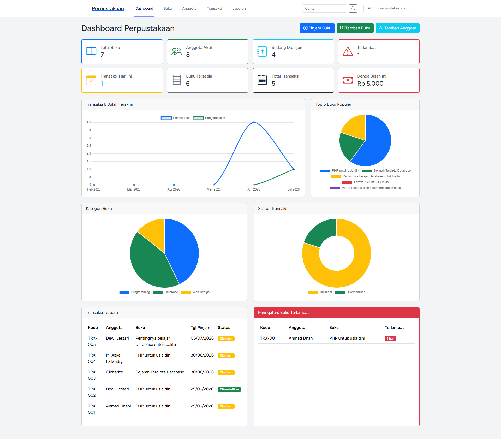
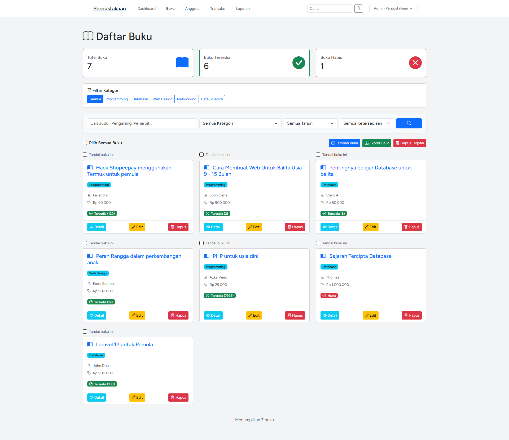
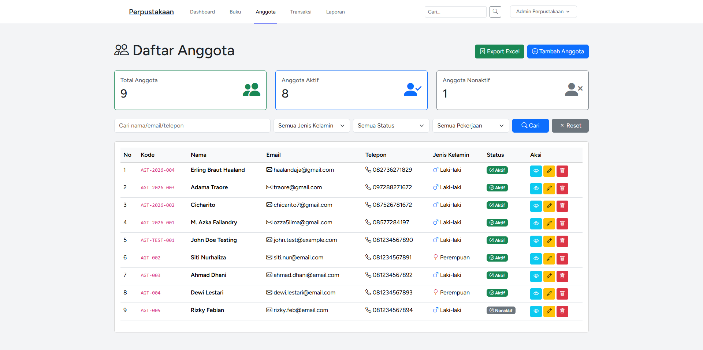
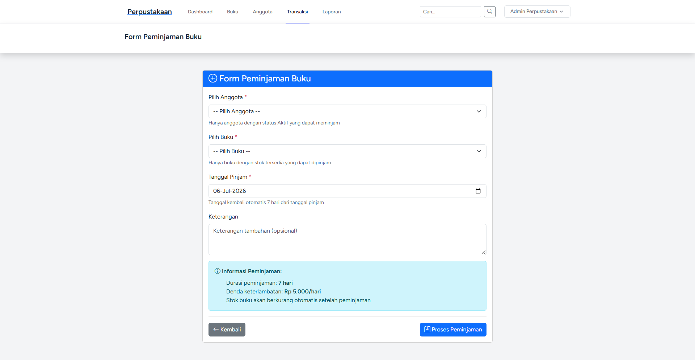
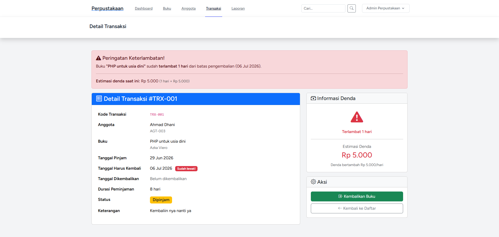
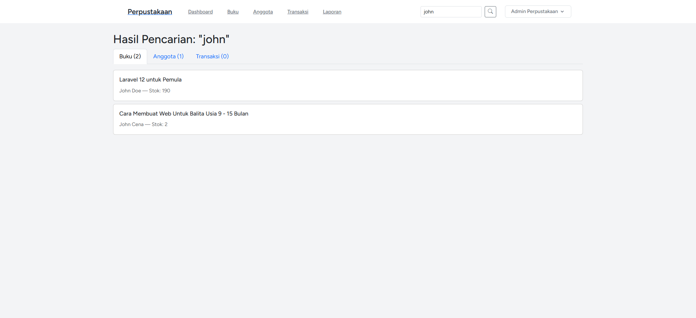
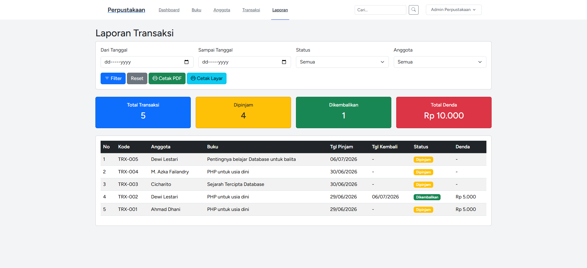

 ## 📸 Dokumentasi Tampilan Aplikasi
 
Berikut adalah hasil tangkapan layar (*screenshot*) dari sistem perpustakaan yang telah dibangun:
 
### 1. Tampilan Login

### 2. Dashboard & Statistik Lanjutan

### 3. Manajemen Data Buku (CRUD Buku)

### 3. Manajemen Data Anggota (CRUD Anggota)

### 4. Transaksi Peminjaman Buku

### 5. Proses Pengembalian Buku & Denda

### 6. Global Search & Filter

### 7. Laporan Transaksi

 

